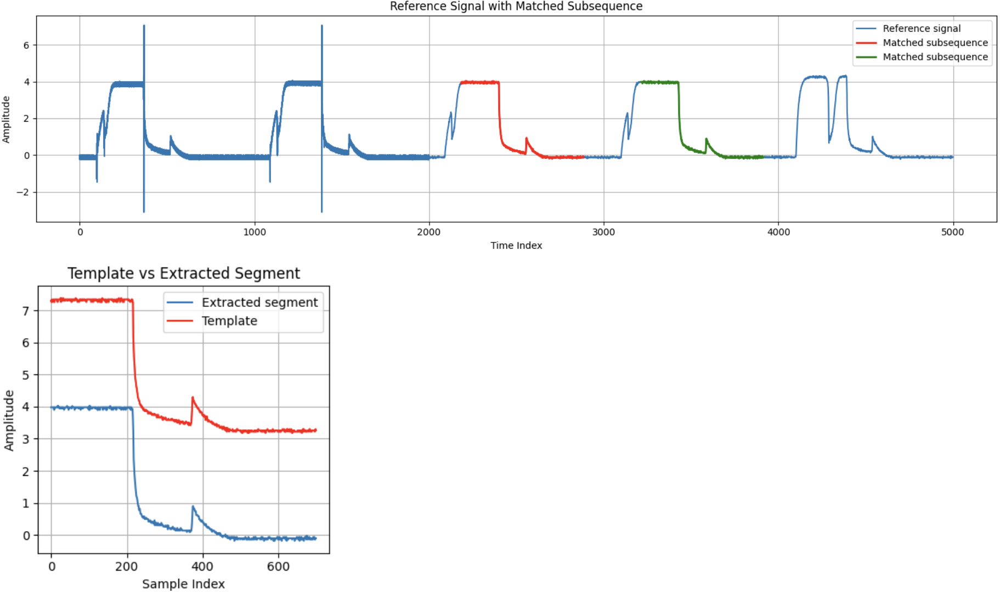

# matrix-profile-pytorch
[](https://colab.research.google.com/drive/1SUWcAMumVsggoWrZ6Fv2ndF0sfMLTzVG?usp=sharing)

This is a fast and simplified implementation of matrix profile with pytorch back-end. 

The implementation does not follow any existing matrix profile algorithm. Instead, its implement a simple brute-force based solution that performing fast dot product that support both GPU and CPU setting. The implementation is easy to use, significant fast than existing package, and can controllable memory usage via batch configuration. 

The code can simply run matrix profile with pytorch backend via:

```python
from matrix_profile_torch import matrix_profile
import torch
ts = torch.randn(1,1000)
mp, mpi = matrix_profile(ts,ls=100)
```

**GPU version running**

If GPU unit is ready to use, the code can perform GPU based running code via:

```python
from matrix_profile_torch import matrix_profile
import torch
ts = torch.randn(1,1000)
ts = ts.cuda()
mp, mpi = matrix_profile(ts,ls=100)
```

**Customized Distance and Mask functions**

The simple code-based also provides flexible matrix profile design by allowing user to use customized distance func and mask functions.

For example, if user would like to implement left matrix profile, it can implemented via simple code below:

```python
import torch
from matrix_profile_torch import query_base_euclidean

def create_batch_mask_left(batch_idx, ts_len, ls):
    if len(batch_idx.shape)==1:
      batch_idx.unsqueeze(0)
    idx = torch.arange(ts_len).unsqueeze(1)
    return (idx-batch_idx).T < ls

mp_left, mpi_left = matrix_profile(ts,ls=100, mode='d', dist_func=query_base_euclidean, mask_func=create_batch_mask_left)
```


**Visualizing Result**

Once matrix profile and index profile is obtained. The code support quick pair motif visualization

```python
plot_pair_motif(ts,mp,mpi,ls=100)
```

A demo example with TEK time series data is included in the provided Google Colab Link. The code will produce the pair motif visualization shown below.



